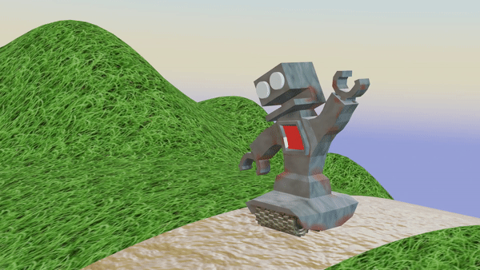

# loopingRobo
Dynamic 3D model assignment for Advanced Game Developmet

Checkout the .mp4 for a clearer video of the render.

## This Project Contains:
* A Robot with a combined procedural and painted texture (for rust!)
* An armature puppeting the robot mesh for animation
* Sculted terrain in a circle for the loop, along with a grass texture applied
* procedural textures on the path and treads of the robot
* A custom enviroment texture with HDRI and gradient background.
* Muliple properties animated like, material on robot's chest, rotation of world, camera angle, position of robot, as well as armature animations.

## What did I learn?
How to animatie armatures, as well as flip animation poses with `Ctrl-Shift-V`, very convenient for a 2 pose animation. To get that flipped pose paste to work, I had to reset the roll on the bones, or else I would have a arm going in front or backwards. Thanks to the command `Clear Roll` that problem solved it. I also learned how to weight paint the verticies on the robot mesh, specifically the head. I wanted the head bone to move the entire head but it had reduced weight at the top of the head, so it would stretch weirdly. You have to select the armature, and then the object and switch into weight paint mode to actually see the bone you're trying to edit. Luckily I figured that out, and now the whole head animates. 

I was trying to use modifiers to curve a flat landscape around a curve object, but that still had bumps like I was making a hexagon rather than a circle for the looping terrain. I discovered the easier approach was to make a high detained cylinder, then delete 2/3s of it, model the terrain on that 1/3, then duplicate it around the origin and merge with the original 1/3d.

Animating using the timeline is very convenient, I never had to edit the node graph or anything thanks to the ability to right-click and select linear-interpolation over things like world rotation so it would loop perfectly. I had some experience animating going into this project but I enjoyed animating more propoerties then I had before, like the material on the robot's chest turning black animating a flicker effect. The timeline also makes it easy to offset animations so multiple things are happening at different intervalls, and you can find the interval you want selecting the whole animation for a property and moving it around until you find the perfect movement.

Here is my node graph for the world texture:

and here is the node graph for my robot combining procedural and painted textures
